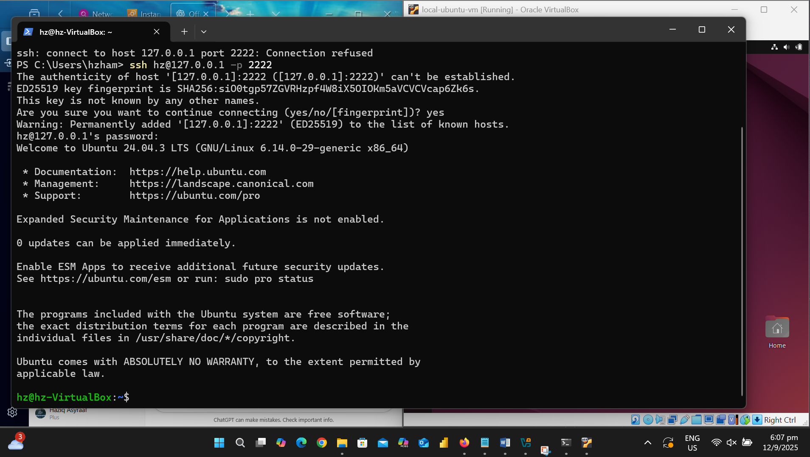

<link rel="stylesheet" href="assets.css">

# Oracle Ubuntu VM Deployment Portfolio 🚀  

[](https://ubuntu.com/)  
[](https://www.virtualbox.org/)  
[](https://www.docker.com/)  
[](https://aws.amazon.com/ec2/)
[](https://github.com/users/haziqachik/projects/1)  
[](https://github.com/haziqachik/oracle-ubuntu-vm-deployment/releases)   
  

---

## 📑 Table of Contents
- [Overview](#overview)  
- [Features](#features)  
- [Architecture](#architecture)  
- [Steps & Proof](#steps--proof)  
  - [1. VirtualBox Deployment](#1-virtualbox-deployment)  
  - [2. Shared Folders](#2-shared-folders)  
  - [3. SSH Setup](#3-ssh-setup)  
  - [4. AWS EC2 Deployment](#4-aws-ec2-deployment)  
  - [5. Nginx Deployment](#5-nginx-deployment)  
  - [6. Docker Setup](#6-docker-setup)  
  - [7. Docker Compose](#7-docker-compose)  
  - [8. Scaling & Monitoring](#8-scaling--monitoring)  
  - [9. Cleanup](#9-cleanup)  
- [Screenshots](#screenshots)  
- [Reflection](#reflection)  
- [Credits](#credits)  

---

## 🌐 Demo
The project is published via **GitHub Pages**:  
👉 [View Project](https://haziqachik.github.io/oracle-ubuntu-vm-deployment/)

---

## 📖 Overview  
This project demonstrates a **complete deployment workflow** using:  
- **Oracle VirtualBox** (local VM setup with Ubuntu 22.04)  
- **AWS EC2** (cloud instance hosting)  
- **Nginx** (basic web server deployment)  
- **Docker & Docker Compose** (containerized workloads, scaling, monitoring)  

The goal: show understanding of **system setup, networking, automation, scaling, monitoring, and cleanup**.  

---

## ✨ Features
- Deploy Ubuntu VM on VirtualBox & AWS EC2  
- Configure shared folders for host ↔ guest file exchange  
- Enable secure SSH login (local + cloud)  
- Deploy & test Nginx web server (localhost + cloud)  
- Run and scale Docker containers using Docker Compose  
- Monitor resource usage with `docker stats`  
- Perform cleanup of containers, images, and networks  

---

## 🏗 Architecture  

```text
Host Machine
│
├── VirtualBox (Ubuntu VM)
│   ├── SSH access (localhost:2222)
│   ├── Shared folder with host
│   ├── Nginx (localhost:8081)
│   ├── Docker containerized services
│   └── Docker Compose scaling (8083–8085)
│
└── AWS EC2 (Ubuntu instance)
    └── Public IP + PEM key → SSH + Nginx test
```

---

## 🛠 Steps & Proof  

### 1. VirtualBox Deployment  
  

### 2. Shared Folders  
  

### 3. SSH Setup  
  

### 4. AWS EC2 Deployment  
<p align="center">
  
</p>

### 5. Nginx Deployment  
- VM localhost (8081):  
    
- VirtualBox:  
    

### 6. Docker Setup  
- Installed Docker & verified version:  
    
- Nginx container running:  
    

### 7. Docker Compose  
- Multiple containers running on ports 8083–8085:  
    

### 8. Scaling & Monitoring  
- `docker stats`:  
    

### 9. Cleanup  
- Containers & networks removed:  
    

---

## 📸 Screenshots  
All screenshots are available in the [`/screenshots`](screenshots) folder.  

---

## 💡 Reflection  
This project gave me hands-on practice with:  
- Setting up **virtual machines (local + cloud)**  
- Working with **SSH keys & secure login**  
- Understanding **Nginx basics** for web serving  
- Using **Docker & Docker Compose** for containerization & scaling  
- Cleaning up environments to maintain efficiency  

It demonstrates a **full lifecycle workflow** → setup → deploy → scale → monitor → cleanup.  

---

## 🙌 Credits  
- Tools: Oracle VirtualBox, AWS EC2, Docker, Nginx, Ubuntu 22.04  
- Author: [Haziq Asyraaf Bin Hamzah](https://github.com/haziqachik)  

---

## 📜 License
This project is licensed under the **MIT License** – see the [LICENSE](LICENSE) file for details.

