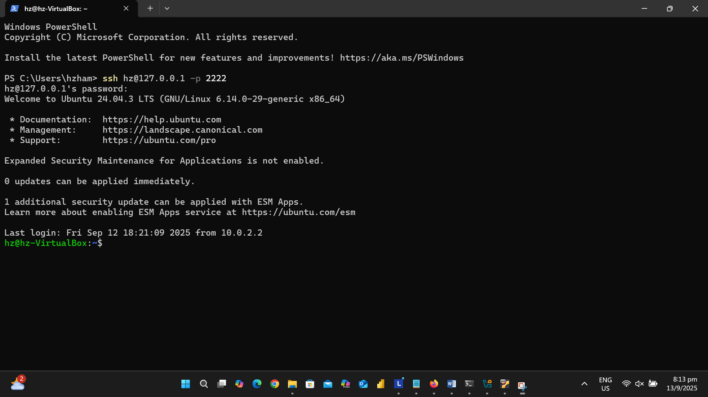
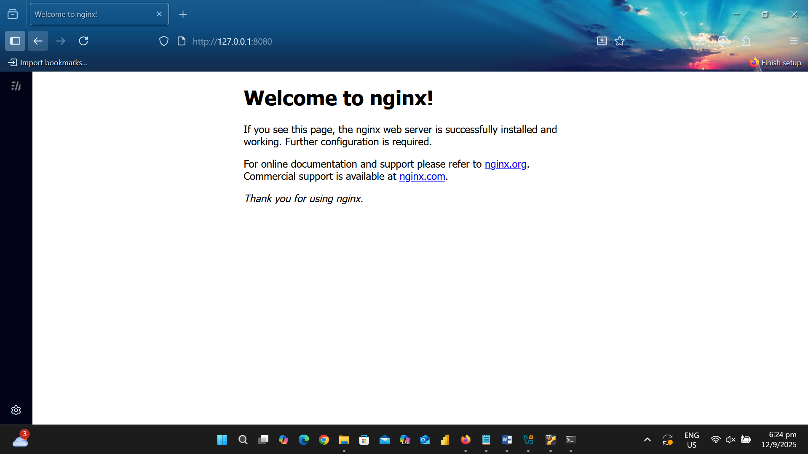

# Oracle Ubuntu VM Deployment Project

## Overview
This project demonstrates setting up an Ubuntu Virtual Machine (VM) on VirtualBox, deploying Nginx locally and on AWS EC2, and managing services using Docker and Docker Compose.  
It also covers integration with VirtualBox features (shared folders, SSH setup) and shows a full container lifecycle: setup → run → scale → monitor → cleanup.

---

## Steps & Screenshots

### Step 1 – EC2 Dashboard


### Step 2 – SSH Login


### Step 3 – Nginx Running in VirtualBox
  


### Step 4 – Nginx on Port 8081


### Step 5 – Docker Container Running (Port 8081)


### Step 6 – Multiple Containers via Docker Compose (Ports 8083–8085)


### Step 7 – Docker Monitoring & Images
  


### Step 8 – Docker Cleanup


### Step 9 – VirtualBox Integration
  
  


---

## Additional Reference Screenshots
These are extra supporting screenshots that provide more details on the setup process.

-   
-   
-   
-   
- 

---

## Extra Documentation
A Word document with additional screenshots is included for reference:  
📄 [oracle-vm-deployment.docx](./oracle-vm-deployment.docx)

---

## Commands Reference

### Docker Lifecycle
```bash
# Run Nginx container
sudo docker run -d --name demo-nginx -p 8081:80 nginx

# List containers
sudo docker ps

# Curl test
curl -I http://127.0.0.1:8081

# Run multiple containers with Compose
sudo docker-compose up -d

# Monitor usage
sudo docker stats --no-stream

# List images
sudo docker images

# Cleanup
sudo docker stop $(sudo docker ps -q)
sudo docker rm $(sudo docker ps -aq)
sudo docker network prune -f
sudo docker rmi nginx
```
